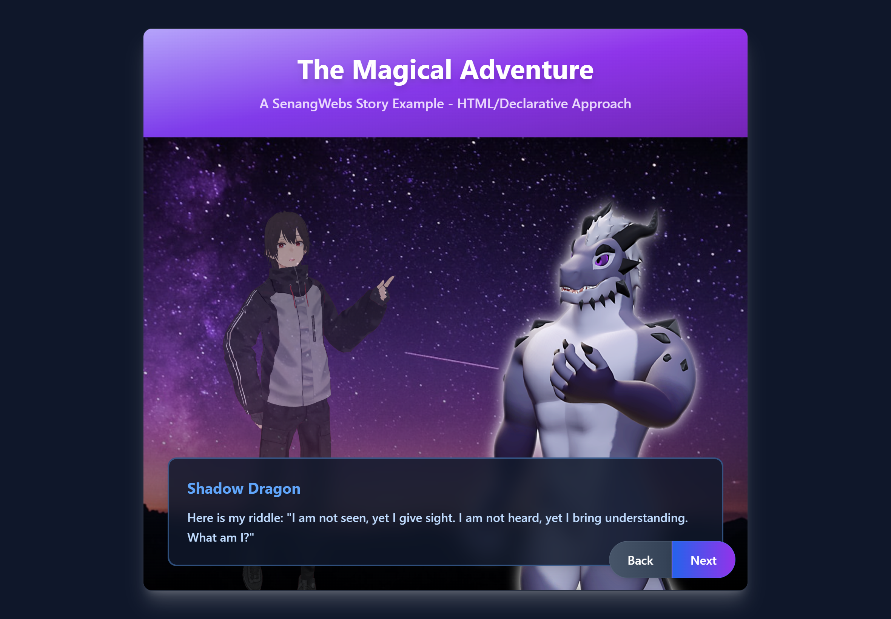

# SenangWebs Story (SWS)

A lightweight, dependency-free JavaScript library for creating interactive, visual novel-style story experiences with typewriter effects and character dialogue management.



[DEMO - https://dev.use.senangwebs.com/make/senangwebs-story-demo](https://dev.use.senangwebs.com/make/senangwebs-story-demo)

## Features

- **Zero Dependencies:** Pure JavaScript with no external libraries required.
- **Dual Initialization:** Build stories declaratively with simple `data-*` attributes in your HTML, or programmatically using a clean JSON structure.
- **Scene & Dialogue Management:** Manages a sequence of scenes and dialogues, tracking the story's state automatically.
- **Dynamic Visuals:**
  - Change background images with each new scene.
  - Display and highlight character images ("subjects").
  - Automatically toggles an `active` class on the current speaker.
- **Typewriter Effect:** Dialogue text is rendered with a classic character-by-character animation with customizable speed.
- **Smart Navigation:** Built-in "next" and "back" navigation with intelligent dialog completion - clicking "next" while text is typing completes the current dialog instead of skipping.
- **Customizable Dialog Speed:** Set typing animation speed using `data-sws-dialog-speed` attribute (HTML) or `dialogSpeed` property (JSON).
- **Event Callbacks:** Execute custom JavaScript functions at the start of any scene or dialogue for enhanced interactivity.
- **Automatic UI Generation:** When using JSON, the library creates the complete HTML structure for the story.
- **Flexible Integration:** Works with your existing HTML structure and is easy to style with CSS.

## Limitations

- **Scene Limit:** Currently supports up to 9 scenes per story (data-sws-scene-1 through data-sws-scene-9).
- **Dialog Limit:** Up to 9 dialogs per scene (data-sws-dialog-1 through data-sws-dialog-9).
- **Single Story Instance:** Each page can have multiple story containers, but each operates independently.
- **Sequential Navigation:** Stories follow a linear progression; no branching or choice-based storylines.

## Quick Start

1. **Include the files:** (Assuming a `dist/` directory)

   ```html
   <link rel="stylesheet" href="dist/sws.css">
   <script src="dist/sws.js"></script>
   ```
2. **Create a minimal story:**

   ```html
   <div data-sws data-sws-dialog-speed="30">
       <!-- Scene 1 -->
       <div data-sws-scene-1>
           <div data-sws-background>
               
           </div>
           <div data-sws-subjects>
               
           </div>
           <div data-sws-dialog-box>
               <h4 data-sws-active-subject-name></h4>
               <div data-sws-dialog-1 data-sws-subject="char1">
                   <p>Hello, welcome to the story!</p>
               </div>
           </div>
       </div>

       <!-- Navigation -->
       <div data-sws-actions>
           <button data-sws-button="back">Back</button>
           <button data-sws-button="next">Next</button>
       </div>
   </div>
   ```

The library automatically initializes on page load and brings your story to life.

## Installation & Build

### Using CDN (Quickest Start)

For the fastest setup, include SWS directly from a CDN:

```html
<!DOCTYPE html>
<html>
<head>
    <title>My Story</title>
    <!-- SWS CSS from CDN -->
    <link rel="stylesheet" href="https://cdn.jsdelivr.net/npm/senangwebs-story@latest/dist/sws.css">
</head>
<body>
    <!-- Your Story HTML here -->
  
    <!-- SWS JavaScript from CDN -->
    <script src="https://cdn.jsdelivr.net/npm/senangwebs-story@latest/dist/sws.js"></script>
</body>
</html>
```

### Development Setup

```bash
# Clone and install dependencies
git clone <repository-url>
cd senangwebs-story
npm install

# Development build with watch mode
npm run dev

# Production build (minified)
npm run build
```

This generates `sws.js` and `sws.css` in the `dist/` directory.

### Direct Usage

Include the built files in your HTML:

```html
<!DOCTYPE html>
<html>
<head>
    <link rel="stylesheet" href="path/to/dist/sws.css">
</head>
<body>
    <!-- Your story HTML here -->
    <script src="path/to/dist/sws.js"></script>
</body>
</html>
```

**Development Note:** The main entry point is `dist/sws.min.js` for production use.

## Story Configuration (HTML)

Configure your story using `data-*` attributes.


| Attribute                      | Description                                                                                      |
| -------------------------------- | -------------------------------------------------------------------------------------------------- |
| `data-sws`                     | **Required.** Marks the root container for a story.                                              |
| `data-sws-id`                  | An optional unique identifier for the story instance.                                            |
| `data-sws-dialog-speed`        | Sets the typewriter animation speed in milliseconds (default: 50). Lower values = faster typing. |
| `data-sws-scene-[n]`           | Defines a scene, where`[n]` is a 1-based index (e.g., `data-sws-scene-1`).                       |
| `data-sws-scene-start`         | A string of JavaScript to execute when the scene begins.                                         |
| `data-sws-background`          | A container within a scene for the background``.                                            |
| `data-sws-subjects`            | A container within a scene for all character`` elements.                                    |
| `data-sws-subject-id`          | A unique ID for a character`` tag.                                                          |
| `data-sws-subject-name`        | The display name for a character, shown above the dialogue.                                      |
| `data-sws-dialog-box`          | The container within a scene that holds the dialogue text.                                       |
| `data-sws-active-subject-name` | An element (e.g.,`<h4>`) to display the current speaker's name.                                  |
| `data-sws-dialog-[n]`          | Defines a single piece of dialogue within a scene.                                               |
| `data-sws-subject`             | Links a dialogue to a character via their`data-sws-subject-id`.                                  |
| `data-sws-dialog-start`        | A string of JavaScript to execute when the dialogue begins.                                      |
| `data-sws-actions`             | The container for navigation controls.                                                           |
| `data-sws-button`              | Defines a button's function. Values:`back` or `next`.                                            |

## Core Components Explained

### Scenes & Dialogues

A story is a collection of **scenes**. Each scene has its own background, set of characters, and a sequence of **dialogues**. The library progresses linearly from dialogue to dialogue, and from scene to scene.

### Subjects (Characters)

Subjects are the characters in your story. You define them with an `` tag and give them a `data-sws-subject-id`. To make a character speak, you link their `id` to a dialogue using the `data-sws-subject` attribute. The library will automatically apply an `active` class to the current speaker.

### Typewriter Effect

To create an immersive experience, all dialogue text is animated with a character-by-character "typewriter" effect. The animation speed can be customized:

- **HTML Approach:** Use `data-sws-dialog-speed="30"` on the story container (speed in milliseconds per character)
- **JSON Approach:** Set `"dialogSpeed": 30` in the story configuration object
- **Default Speed:** 50ms per character if no speed is specified

**Smart Navigation:** Clicking "next" or "back" while the typewriter animation is running will instantly complete the current dialog text before proceeding. This ensures users never accidentally skip dialog content while it's still typing.

## Dialog Speed Customization

The typewriter animation speed can be customized to match your story's pacing needs:

### HTML/Declarative Approach

```html
<!-- Fast dialog speed (20ms per character) -->
<div data-sws data-sws-dialog-speed="20">
    <!-- Your story content -->
</div>

<!-- Slow dialog speed (100ms per character) -->
<div data-sws data-sws-dialog-speed="100">
    <!-- Your story content -->
</div>

<!-- Default speed (50ms per character) - no attribute needed -->
<div data-sws>
    <!-- Your story content -->
</div>
```

### JSON/Programmatic Approach

```javascript
const fastStory = {
    "id": "fast_story",
    "dialogSpeed": 20, // Fast: 20ms per character
    "scenes": [/* ... */]
};

const slowStory = {
    "id": "slow_story", 
    "dialogSpeed": 100, // Slow: 100ms per character
    "scenes": [/* ... */]
};

// Create instances with different speeds
new SWS(container1, fastStory);
new SWS(container2, slowStory);
```

### Speed Guidelines

- **Very Fast:** 10-20ms - Good for action sequences or when users want to read quickly
- **Normal:** 30-50ms - Balanced speed for most stories (default: 50ms)
- **Slow:** 60-100ms - Dramatic effect, good for emphasizing important dialogue
- **Very Slow:** 100ms+ - Special dramatic moments or accessibility needs

**Note:** Lower values mean faster typing. The value represents milliseconds between each character appearing.

## JavaScript API

### Programmatic Initialization

Besides using HTML attributes, you can initialize a story with a JavaScript object. This is ideal for dynamically loading story content.

```javascript
// Get the container element
const storyContainer = document.getElementById('my-story');

// Define the story using a JSON structure
const storyData = {
  "id": "my_json_story",
  "dialogSpeed": 25, // Custom dialog speed: 25ms per character
  "scenes": [
    {
      "sceneStart": "alert('Chapter 1 Begins!')",
      "background": "path/to/background1.jpg",
      "subjects": [
        { "id": "hero", "name": "Hero", "src": "path/to/hero.png" }
      ],
      "dialogs": [
        { "subjectId": "hero", "text": "This story was created entirely from a JavaScript object." },
        { "text": "This line is narrative text, with no active speaker." }
      ]
    },
    {
      "background": "path/to/background2.jpg",
      "subjects": [
        { "id": "hero", "name": "Hero", "src": "path/to/hero.png" },
        { "id": "villain", "name": "Villain", "src": "path/to/villain.png" }
      ],
      "dialogs": [
        { "subjectId": "villain", "dialogStart": "console.log('The villain appears!')", "text": "You've finally arrived!" },
        { "subjectId": "hero", "text": "It's over, Villain!" }
      ]
    }
  ]
};

// Create a new SWS instance
const myStory = new SWS(storyContainer, storyData);
```

### Public Methods

You can control the story flow programmatically.

```javascript
// Assuming 'myStory' is an SWS instance
myStory.next(); // Moves to the next dialogue/scene
myStory.back(); // Moves to the previous dialogue/scene
```

## Styling & Customization

### Key CSS Selectors & Classes


| Selector/Class                   | Description                                           |
| ---------------------------------- | ------------------------------------------------------- |
| `[data-sws]`                     | The main story container.                             |
| `[data-sws-scene-n]`             | An individual scene container.                        |
| `[data-sws-background] img`      | The background image.                                 |
| `[data-sws-subjects] img`        | A character image.                                    |
| `.active`                        | Applied to the currently speaking character's``. |
| `[data-sws-dialog-box]`          | The black box containing the dialogue text.           |
| `[data-sws-active-subject-name]` | The element holding the speaker's name.               |
| `[data-sws-actions] button`      | The navigation buttons.                               |

### Custom Styling Example

```css
/* Make the active character pop */
[data-sws-subjects] img {
    transition: transform 0.3s ease, opacity 0.3s ease;
    opacity: 0.6;
}

[data-sws-subjects] img.active {
    opacity: 1;
    transform: scale(1.05) translateY(-10px);
}

/* Customize the dialog box */
[data-sws-dialog-box] {
    background: rgba(50, 20, 80, 0.8); /* A dark purple */
    border-top: 4px solid #9f7aea;
}

/* Style the speaker's name */
[data-sws-active-subject-name] {
    color: #fbd38d; /* A nice gold color */
    font-style: italic;
}
```

## Examples

Check the `examples/` directory for complete implementations:

- **`examples/index.html`** - A full story built using HTML `data-*` attributes with Tailwind CSS styling and custom dialog speed.
- **`examples/json.html`** - Stories initialized from JavaScript objects with custom styling and dialog speed demonstration.

## Browser Support

Works in all modern browsers supporting:

- ES6 Classes and Arrow Functions
- Dataset API (`element.dataset`)
- Modern DOM methods (`querySelector`, `addEventListener`)
- Minimum recommended: Chrome 49+, Firefox 45+, Safari 10+, Edge 13+

## Technical Notes

- **File Structure:** The library outputs both development (`sws.js`) and production (`sws.min.js`) builds.
- **CSS Framework Compatibility:** Works with frameworks like Tailwind CSS (see examples).
- **Performance:** Optimized for smooth typewriter animations and responsive UI updates.
- **Memory Management:** Automatically cleans up timeouts and event listeners.

## Troubleshooting

### Common Issues

- **Story not initializing:** Ensure the `data-sws` attribute is present on the root container.
- **Scenes not switching:** Check that scene numbering follows the pattern `data-sws-scene-1`, `data-sws-scene-2`, etc.
- **Dialogs not appearing:** Verify dialog elements have the correct `data-sws-dialog-[n]` attributes and contain a `<p>` tag.
- **Characters not highlighting:** Ensure `data-sws-subject-id` matches the `data-sws-subject` value in dialogs.
- **Dialog speed not working:** Check that `data-sws-dialog-speed` contains a valid positive number, or `dialogSpeed` in JSON config is a number.
- **Next button skipping dialogs:** This behavior has been improved - clicking Next now completes the current dialog instead of skipping when typing is in progress.
- **Console errors:** Check browser developer tools for specific error messages and missing elements.

## License

MIT License - see LICENSE file for details.

## Contributing

Contributions are welcome! Please ensure any changes maintain the library's lightweight, dependency-free nature.
